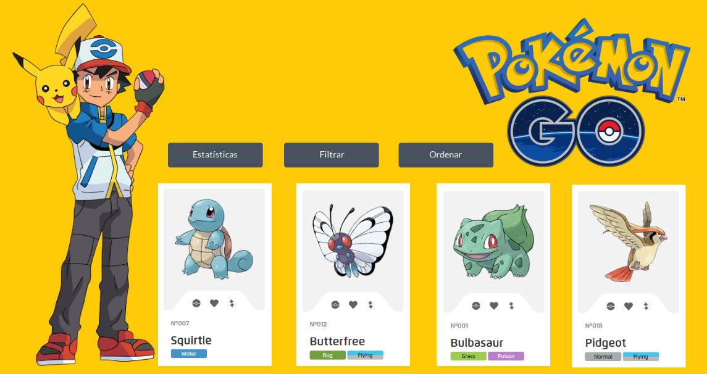
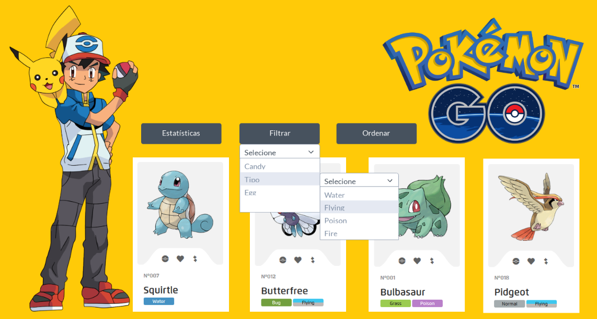
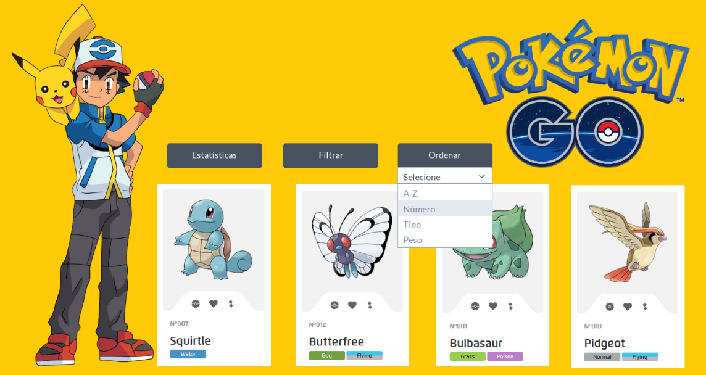
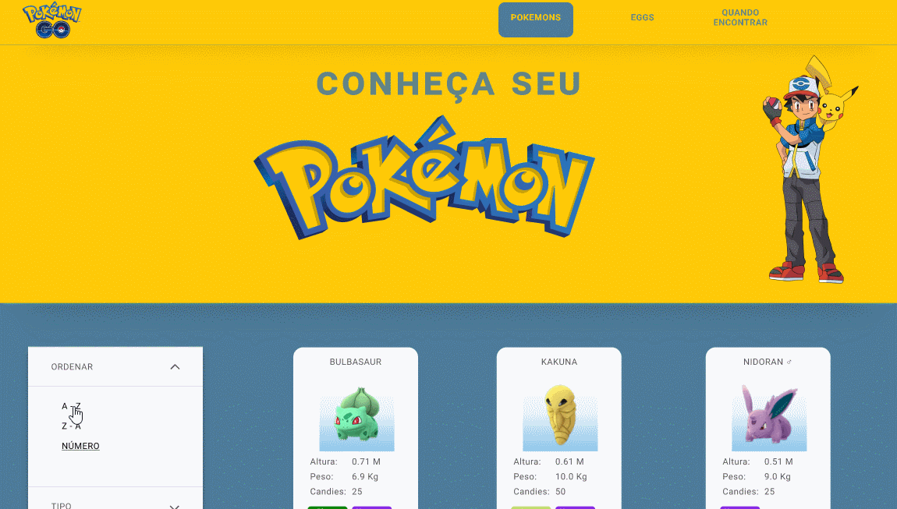
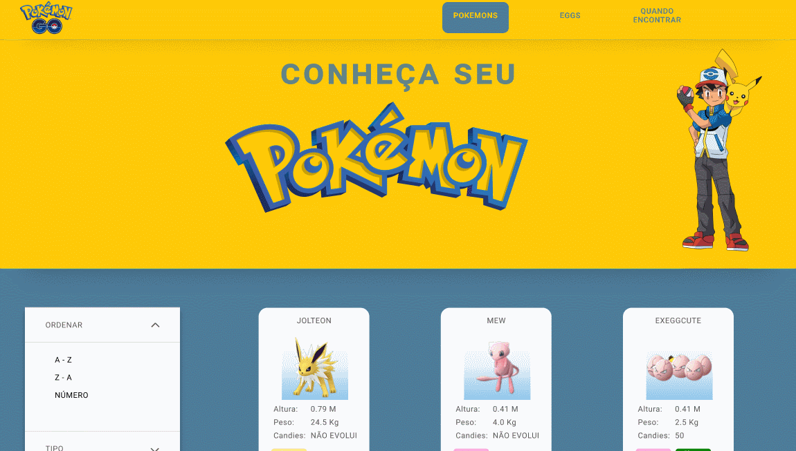
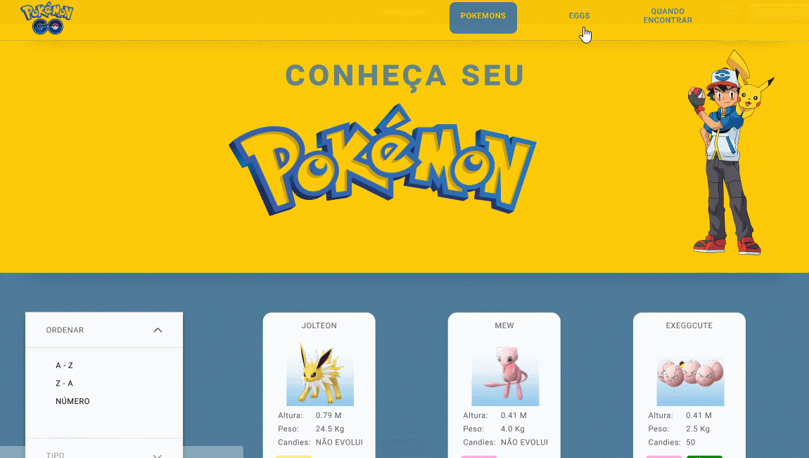
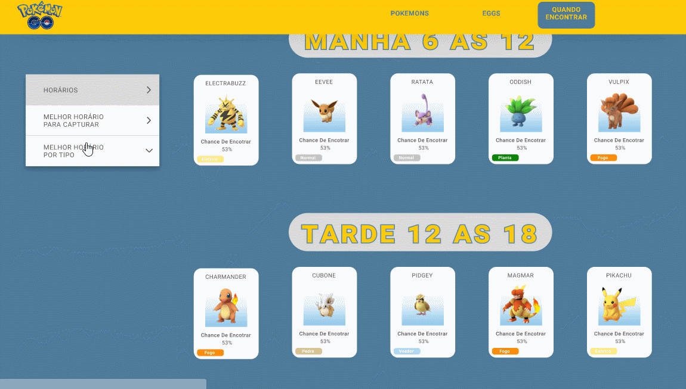
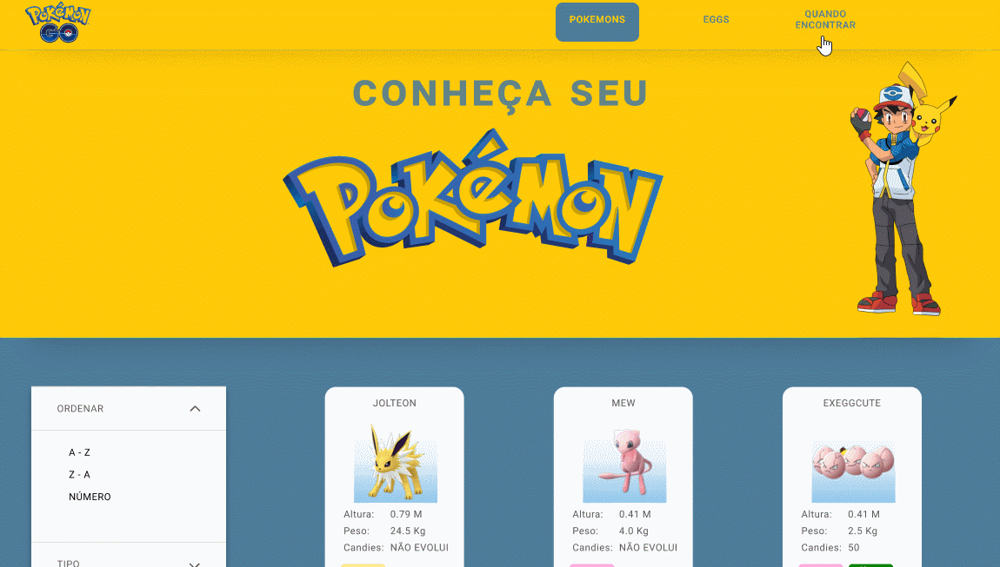

## Introdução

> O Data-Lovers Pokémon Go foi desenvolvido para oferecer aos usuários do game mais informações sobre os 151 Pokémons da região de Kanto. Os usuários podem ordenar por nome de A-Z ou Z-A e número, além de filtrar pelo tipo do Pokémon.
O site também mostra quais Pokémons são encontrados em ovos e quantos quilômetros são necessários andar para chocá-los. Na parte de cálculos e estatísticas, os jogadores têm acesso à dados como horários para encontrar os Pokémons, melhor horário para capturar e melhorar horário para capturar de acordo com o tipo.
A lógica do projeto foi desenvolvida em JavaScript (ES6), HTML e CSS, acessando e manipulando de forma dinâmica um arquivo JSON. 
## Protótipos

> Um primeiro protótipo passo por testes de usabilidade. O grupo de usuários relatou a necessidade de uma header, menu com opção de filtrar e ordenar na lateral, nav com links de acessos à páginas com informações separadas para melhor visualização. 

> A segunda versão do protótipo foi desenvolvida visando atender ao máximo possível das necessidades das personas. 

